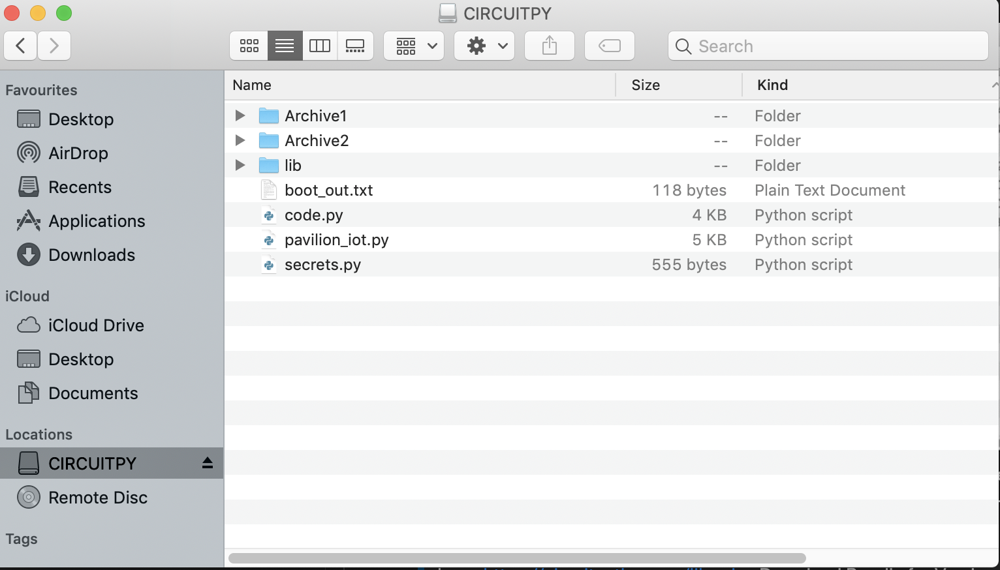

# The Air Quality Pop-Up Pavilion

### Table of Contents

- [Project Description and Overview](#description-and-overview)
- [Assembling the Pavilion](#assembling-the-pavilion)
- [Wiring the Pavilion](#wiring-the-pavilion)
- [Running Circuitpython on adafruit esp32s2 feather](#running-circuitpython-on-adafruit-esp32s2-feather)
- [Coding the Pavilion](#coding-the-pavilion)
- [Visualising data with Adafruit IO](#visualising-data-with-adafruit-io)
- [Tutorials used](#tutorial-used)
- [Components](#components)
- [Author Info](#author-info)

## Project Description and Overview
Since the pandemic, social distancing along with the need for additional space and appropriate ventilation has become hugely important. Because of this, I want to also explore the concept of a POP-UP Pavilion - A pavilion that could be installed in different locations to provide space & healthy indoor air quality solutions where needed. There is a range of settings that could benefit from this, including classrooms, maker spaces & eating areas in the hospitality sector, to name just a few. I want to develop and refine a scaled-down fully working model of this pavilion concept and ultimately create a workshop based on it that will enable me to deliver hands-on sessions to other young people - giving them the opportunity to explore how spaces can monitor & react to internal air quality in order to improve the experience of the users.

The pavilion uses an internal sensor to monitor & then trigger various reactions to the co2 levels from inside. The reactions include opening & closing motorised shutter walls, an automatic sliding skylight, a ventilation fan & colour coded co2 level warning lights. I have used stepper motors & servos to generate the movement, and an Adafruit ESP 32-S2 as the brain stacked with a TFT screen to display the air quality data from the wall of the pavilion. The data is also visualised via IoT on Adafruit IO

## Assembling the Pavilion

Design for assembling the Pavilion can be found in the Design files folder:
> https://github.com/Avmaker/Pavilion/tree/main/Design%20files

[Back To The Top](#the-air-quality-pop-up-pavilion)

## Wiring the Pavilion

> Wiring The Motors

>Wiring The Electronic Components

## Running CircuitPython on Adafruit ESP32-S2 Feather
Guide on how to get CircuitPython running on the ESP32-S2 board
>https://learn.adafruit.com/adafruit-esp32-s2-feather/circuitpython

Install CircuitPython 7.2.5: 
>Guide: https://circuitpython.org/board/adafruit_feather_esp32s2/

Install Mu Editor
Mu is a simple code editor that works with the Adafruit CircuitPython boards. It's written in Python and works on Windows, MacOS, Linux and Raspberry Pi. 
>Download Mu from https://codewith.mu.

[Back To The Top](#the-air-quality-pop-up-pavilion)

The CIRCUITPY Drive
>https://learn.adafruit.com/adafruit-esp32-s2-feather/the-circuitpy-drive

The CIRCUITPY drive is where your code and the necessary libraries and files will live. You can edit your code directly on this drive and when you save, it will run automatically. When you create and edit code, you'll save your code in a code.py file located on the CIRCUITPY drive. 

With a fresh CircuitPython install, on your CIRCUITPY drive, you'll find a code.py file containing print("Hello World!") and an empty lib folder. 

CircuitPython looks for code.py and executes the code within the file automatically when the board starts up or resets. Following a change to the contents of CIRCUITPY, such as making a change to the code.py file, the board will reset, and the code will be run 

CircuitPython Librairies needed for the Pavilion Project
Libraries are stored on your CIRCUITPY drive in a folder called lib.
You can download the latest Adafruit CircuitPython Library Bundle 
>here: https://circuitpython.org/libraries
Download Bundle for Version 7.x

The libraries that will be needed for the Pavillion project are listed below. Copy them from the bundle and include them into your lib folder.

[Back To The Top](#the-air-quality-pop-up-pavilion)

## Coding the Pavilion

I coded the pavilion using Circuit Python to code the stepper motors, the servos, the Neopixels, the fan, the Co2 sensor and the TFT screen
> https://github.com/Avmaker/Pavilion/blob/main/Code/code.py

cf pdf file in Assembling Instruction folder
and Youtube assembly link video tutorial: 
> XXX

## Visualising data with Adafruit IO
### Adafruit Platform

You’‘ll need to create an account on adafruit.com

Secrets.py File
It allows you to store your WiFi network's SSID and password, along with other sensitive information, separately from your main program, so that you don't accidentally share your info when sharing your code.

Head to io.adafruit.com and simply click the View AIO Key link on the left hand side of the Adafruit IO page to get this information.

You will need your network information, as well as an Adafruit IO account. Your Adafruit AIO information and your location will also be placed in the file.

Using Mu or any text editor, you should add your Adafruit IO Username and Adafruit IO Key to the secrets.py file.

Once you have logged into your account, there information you'll need to place in your secrets.py file: Adafruit IO username, and Adafruit IO key, broker, mqtt port, mqtt username and mqtt passord in the secrets.py file. 

Your secrets.py file should look similar to this:

> secrets = {
    ‘ssid’ : ‘your SSID here’,
    ‘password’ : ‘Your password here’,
     ‘aio_username’ : ‘your aio username’,
    ‘aio_key’ : ‘your aio key’,
    ‘broker’: “io.adafruit.com” ,
    ‘mqtt_port’: 8883,
    ‘mqtt_username’: ‘your aio_username’,
    ‘mqtt_password’: ‘your aio_key’,
    }

Save you secrets.py file in yourCIRCUITPY root file

[Back To The Top](#the-air-quality-pop-up-pavilion)

### Code for Pavilion Iot
I also used CircuitPython to code the visualisation of the date on Adafruit IO.
> https://github.com/Avmaker/Pavilion/blob/main/Code/pavilion_iot.py
(to run, change name to code.py)

### Adafruit IO set up
> https://learn.adafruit.com/welcome-to-adafruit-io/getting-started-with-adafruit-io

Head over to io.adafruit.com and click Sign In to log into IO using your Adafruit account. It's free and fast to join.

Create Feeds & Dashboard

- Feeds

> Follow Adafruit guide here : https://learn.adafruit.com/adafruit-io-basics-feeds 

- Dashboards
> Follow Adafruit guide here: https://learn.adafruit.com/adafruit-io-basics-dashboards

[Back To The Top](#the-air-quality-pop-up-pavilion)

## Components 
**What you will need**
- Adafruit ESP32-S2 Feather with BME280 Sensor
- Adafruit Stepper Motor Featherwing
- Adafruit TFT FeatherWing - 2.4" 320x240. Touchscreen For All Feathers
- Adafruit SCD 40 - True CO2, Temperature and Humidity Sensor
- Mini Stepper Motor - 200 Steps - 20x30mm NEMA-8 Size (2 off)
- Micro 360 Degree Continuous Rotation Servo FS90R
- Linear actuator
- 5V DC, Axial Fan, 40 x 40 x 10mm, 7CFM
- Relay - 5V
- Kitronik ZIP Stick - 5 ZIP LED
- 4mm Economy Birch Laser Plywood - 600mm x 400mm
- sheet Clear Perspex Sheet (Cast) 4mm x 600mm x 400mm Lipo Battery - 3.7 v; 500mAh
- AA Battery pack; 3x 1.5V
- Jumper wires
- USB C to B Cable
- M3 button head screws
- M3 hex nuts

[Back To The Top](#the-air-quality-pop-up-pavilion)

## Tutorials used

Adafruit ESP32-32 Feather:
- https://learn.adafruit.com/adafruit-esp32-s2-feather

Stepper motor Featherwing:

- https://learn.adafruit.com/adafruit-stepper-dc-motor-featherwing

- https://thepihut.com/products/mini-stepper-motor-200-steps-20x30mm-nema-8-size

Co2 sensor Adafruit SCD40:

- https://learn.adafruit.com/adafruit-scd-40-and-scd-41?view=all

Adafruit IO set up

- https://learn.adafruit.com/welcome-to-adafruit-io/getting-started-with-adafruit-io

- https://learn.adafruit.com/adafruit-io-basics-feeds

- https://learn.adafruit.com/adafruit-io-basics-dashboards

## Author Info
- Avye Couloute [10 To No Limit](https://10tonolimit.com)
- Girls Into Coding [Girls Into Coding](https://girlsintocoding.com)
- Twitter - [@girlsintocoding](https://twitter.com/girlsintocoding)
- Instagram: [@girls_into_coding](https://www.instagram.com/girls_into_coding/)
- Website - [Girls Into Coding](https://girlsintocoding.com)

[Back To The Top](#the-air-quality-pop-up-pavilion)
